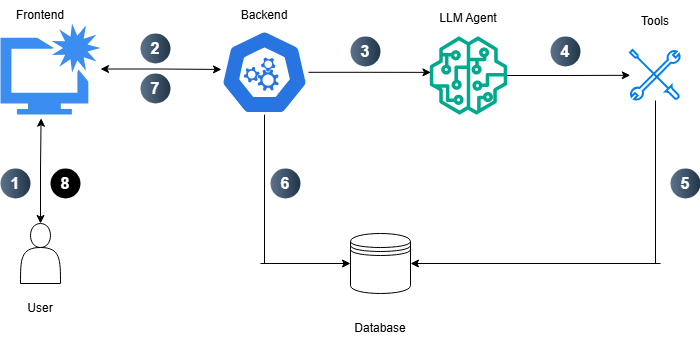

 # Library-Disk-AI-Agent

A conversational AI-powered library/bookstore assistant built with Streamlit for the frontend and FastAPI for the backend. The system leverages LangChain and Ollama to handle queries, execute tools, and manage book orders, inventory, and customer interactions.

---
## 🔁 Agent Wokflow


## Features

- **Chat-based interface** to interact with the library agent.
- **Session management**: start new sessions or load previous ones.
- **Database-backed storage**: all user queries, agent responses, and executed tool calls are stored in SQLite.
- **Book management tools**:
  - Search books by title or author
  - Create customer orders
  - Restock books
  - Update book prices
  - Check order status
  - Inventory summary for low-stock books
- **Agent orchestration**: executes tools based on user prompts.

---

## 💡 Example: Streamlit App in Action

Once you run the Streamlit app, you’ll see an interface like this:


## Requirements

- Python 3.10+
- Libraries (can be installed via `requirements.txt`):
- [SQLite3](https://www.sqlite.org/index.html) – For storing messages, tool calls, books, and orders
- [Ollama 3.1](https://ollama.com/) – LLM model used via LangChain Ollama integration

```bash
pip install -r requirements.txt
```
---

## Project Structure
```
.
├── server/
│   ├── __init__.py
│   ├── api.py                  # FastAPI endpoints
│   ├── api_helper_functions.py # Agent helper functions (store messages, call agent)
│   ├── agent.py                # LLM and tools setup
│   ├── db.py                   # Database query and execution functions
│   └── tools.py                # Bookstore business logic functions
├── prompts/
│   └── bookstore_prompt.txt    # System prompt for agent
├── db/
│   ├── library.db              # SQLite database
│   ├── schema.sql              # DB schema definitions
│   └── seed.sql                # Seed data for initial testing
├── app/
│   └── app.py                  # Streamlit frontend
├── requirements.txt            # Python dependencies
├── .gitignore                  # Git ignore file
└── README.md                   # Project README
```
---

## Project Setup
### 1. Clone the repository

```bash
git clone https://github.com/Hashem-Qaryouti/llama3-rag-pipeline.git
cd <your-repo-name>
```
### 2. Create and activate a virtual environment
```bash
python -m venv <your-venv-name>
```
#### Activate the environment:
- **Windows:**
```bash
<your-venv-name>\Scripts\activate
```
- **Linux:**
```bash
source <your-venv-name>/bin/activate
```
### 3. Install dependencies
```bash
pip install -r requirements.txt

```

### 4. Set up the Database 
1. Create the SQLite database file (if not already created):

```bash
touch db/library.db
```
2. Initialize the database schema:
 ```bash
sqlite3 db/library.db < db/schema.sql
```
3. Seed the database with initial data:
 ```bash
sqlite3 db/library.db < db/seed.sql
```

### 5. Pull the Ollama Model
```bash
ollama pull llama3.1
```
---
## Database Tables and Seed Instructions
### 1. BOOKS
Columns:
- `isbn` (TEXT) → Primary Key, must be unique, not null.
- `title` (TEXT) → Not null.
- `author` (TEXT) → Not null.
- `price` (REAL) → Not null, represents the book price.
- `stock` (INTEGER) → Not null, represents quantity available.

**Insertion rules:**
- `isbn` must be unique for each book.
- `title`, `author`, `price`, and `stock` cannot be null.

---

### 2. CUSTOMERS
Columns:
- `id` (INTEGER) → Primary Key, auto-incremented.
- `name` (TEXT) → Not null.
- `email` (TEXT) → Optional.

**Insertion rules:**
- `id` will be automatically generated.
- `name` is required.
- `email` can be left null.

---

### 3. ORDERS
Columns:
- `id` (INTEGER) → Primary Key, auto-incremented.
- `customer_id` (INTEGER) → Not null, must reference a valid customer in `CUSTOMERS`.
- `created_at` (TEXT) → Defaults to current timestamp if not provided.

**Insertion rules:**
- `customer_id` must exist in the `CUSTOMERS` table.
- `created_at` can be omitted to use the current timestamp.

---

### 4. ORDER_ITEMS
Columns:
- `order_id` (INTEGER) → Foreign key, references `ORDERS.id`.
- `isbn` (TEXT) → Foreign key, references `BOOKS.isbn`.
- `quantity` (INTEGER) → Quantity of books in the order.
- `price` (REAL) → Price of each item at order time.

**Insertion rules:**
- `order_id` must correspond to an existing order.
- `isbn` must exist in the `BOOKS` table.
- `quantity` should be a positive integer.
- `price` should match or reflect the price of the book at order time.

---

This gives anyone manual guidance on **which columns are required, which are optional, and which are auto-generated** when seeding data.

## Usage
1. Run the Backend API
```bash
uvicorn server.api:app --reload --host 0.0.0.0 --port 8000
```
2. Run the Streamlit App
```bash
streamlit run app/app.py
```
- **Open the URL shown in your terminal (usually http://localhost:8501):**
- **Enter your question in the text box and click Send**
